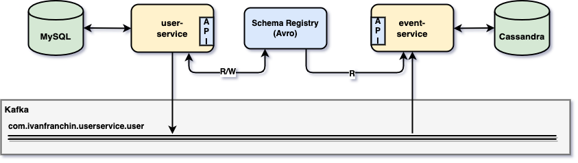
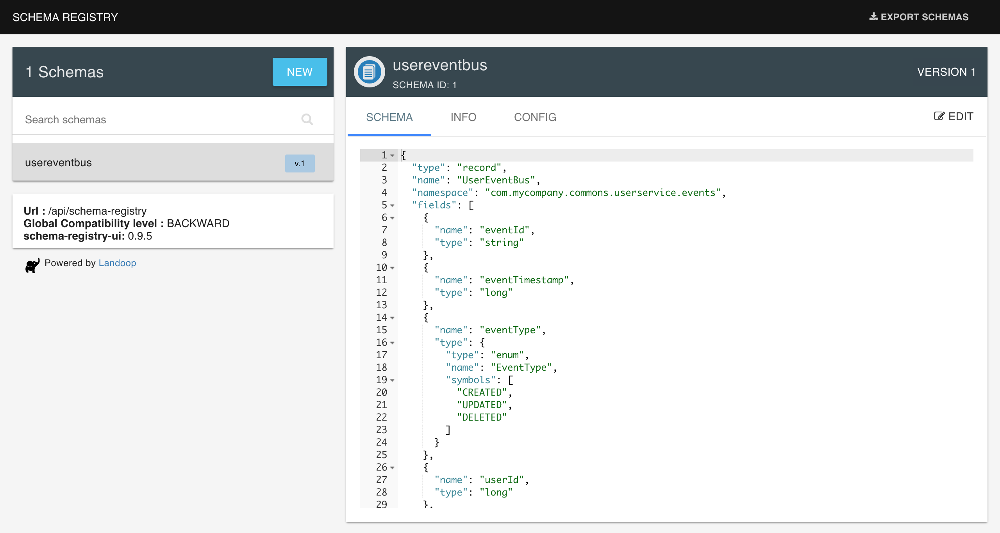

# spring-cloud-stream-event-sourcing-testcontainers

The goal of this project is to create a [`Spring Boot`](https://docs.spring.io/spring-boot/docs/current/reference/htmlsingle/) application that handles `users` using [`Event Sourcing`](https://martinfowler.com/eaaDev/EventSourcing.html). So, besides the traditional create/update/delete, whenever a user is created, updated, or deleted, an event informing this change is sent to [`Kafka`](https://kafka.apache.org). Furthermore, we will implement another `Spring Boot` application that listens to those events and saves them in [`Cassandra`](https://cassandra.apache.org). Finally, we will use [`Testcontainers`](https://www.testcontainers.org) for integration testing.

> **Note:** In [`kubernetes-minikube-environment`](https://github.com/ivangfr/kubernetes-minikube-environment/tree/master/user-event-sourcing-kafka) repository, it's shown how to deploy this project in `Kubernetes` (`Minikube`)

## Project Architecture



## Applications

- ### user-service

  `Spring Boot` Web Java application responsible for handling users. The user information is stored in [`MySQL`](https://www.mysql.com). Once a user is created, updated or deleted, an event is sent to `Kafka`.
  
  

  - **Serialization format**

    `user-service` can use [`JSON`](https://www.json.org) or [`Avro`](https://avro.apache.org) format to serialize data to the `binary` format used by `Kafka`. If we choose `Avro`, both services will benefit by the [`Schema Registry`](https://docs.confluent.io/current/schema-registry/docs/index.html) that is running as Docker container. The serialization format to be used is defined by the value set to the environment variable `SPRING_PROFILES_ACTIVE`.
  
    | Configuration                    | Format |
    |----------------------------------|--------|
    | `SPRING_PROFILES_ACTIVE=default` | `JSON` |
    | `SPRING_PROFILES_ACTIVE=avro`    | `Avro` |

- ### event-service

  `Spring Boot` Web Java application responsible for listening events from `Kafka` and saving them in `Cassandra`.

  

  - **Deserialization**
  
    Differently from `user-service`, `event-service` has no specific Spring profile to select the deserialization format. [`Spring Cloud Stream`](https://docs.spring.io/spring-cloud-stream/docs/current/reference/htmlsingle) provides a stack of `MessageConverters` that handle the conversion of many types of content-types, including `application/json`. Besides, as `event-service` has `SchemaRegistryClient` bean registered, `Spring Cloud Stream` auto configures an Apache Avro message converter for schema management.
    
    In order to handle different content-types, `Spring Cloud Stream` has a _"content-type negotiation and transformation"_ strategy (more [here](https://docs.spring.io/spring-cloud-stream/docs/current/reference/htmlsingle/#content-type-management)). The precedence orders are: first, content-type present in the message header; second, content-type defined in the binding; and finally, content-type is `application/json` (default).
    
    The producer (in the case `user-service`) always sets the content-type in the message header. The content-type can be `application/json` or `application/*+avro`, depending on with which `SPRING_PROFILES_ACTIVE` the `user-service` is started.
  
  - **Java classes from Avro Schema**
  
    Run the following command in `spring-cloud-stream-event-sourcing-testcontainers` root folder. It will re-generate the Java classes from the Avro schema present at `event-service/src/main/resources/avro`.
    ```
    ./mvnw compile --projects event-service
    ```
  
## Prerequisites

- [`Java 11+`](https://www.oracle.com/java/technologies/downloads/#java11)
- [`Docker`](https://www.docker.com/)
- [`Docker-Compose`](https://docs.docker.com/compose/install/)

## Start Environment

- In a terminal and inside `spring-cloud-stream-event-sourcing-testcontainers` root folder run
  ```
  docker-compose up -d
  ```

- Wait for Docker containers to be up and running. To check it, run
  ```
  docker-compose ps
  ```

## Running Applications with Maven

- **user-service**

  - In a terminal, make sure you are inside `spring-cloud-stream-event-sourcing-testcontainers` root folder
  
  - In order to run the application, you can pick between `JSON` or `Avro`
    - Using `JSON`
      ```
      ./mvnw clean spring-boot:run --projects user-service
      ```
    - Using `Avro`
      ```
      ./mvnw clean spring-boot:run --projects user-service -Dspring-boot.run.profiles=avro
      ```

- **event-service**

  - In a new terminal, make sure you are inside `spring-cloud-stream-event-sourcing-testcontainers` root folder
  
  - Run the following command
    ```
    ./mvnw clean spring-boot:run --projects event-service
    ```

## Running Applications as Docker containers

- ### Build Docker Images

  - In a terminal, make sure you are inside `spring-cloud-stream-event-sourcing-testcontainers` root folder

  - Run the following script to build the Docker images
    - JVM 
      ```
      ./docker-build.sh
      ```
    - Native (it's not working, see [Issues](#issues))
      ```
      ./docker-build.sh native
      ```

- ### Environment Variables
   
  - **user-service**

    | Environment Variable   | Description                                                                          |
    |------------------------|--------------------------------------------------------------------------------------|
    | `MYSQL_HOST`           | Specify host of the `MySQL` database to use (default `localhost`)                    |
    | `MYSQL_PORT`           | Specify port of the `MySQL` database to use (default `3306`)                         |
    | `KAFKA_HOST`           | Specify host of the `Kafka` message broker to use (default `localhost`)              |
    | `KAFKA_PORT`           | Specify port of the `Kafka` message broker to use (default `29092`)                  |
    | `SCHEMA_REGISTRY_HOST` | Specify host of the `Schema Registry` to use (default `localhost`)                   |
    | `SCHEMA_REGISTRY_PORT` | Specify port of the `Schema Registry` to use (default `8081`)                        |
    | `ZIPKIN_HOST`          | Specify host of the `Zipkin` distributed tracing system to use (default `localhost`) |
    | `ZIPKIN_PORT`          | Specify port of the `Zipkin` distributed tracing system to use (default `9411`)      |

  - **event-service**

    | Environment Variable   | Description                                                                          |
    |------------------------|--------------------------------------------------------------------------------------|
    | `CASSANDRA_HOST`       | Specify host of the `Cassandra` database to use (default `localhost`)                |
    | `CASSANDRA_PORT`       | Specify port of the `Cassandra` database to use (default `9042`)                     |
    | `KAFKA_HOST`           | Specify host of the `Kafka` message broker to use (default `localhost`)              |
    | `KAFKA_PORT`           | Specify port of the `Kafka` message broker to use (default `29092`)                  |
    | `SCHEMA_REGISTRY_HOST` | Specify host of the `Schema Registry` to use (default `localhost`)                   |
    | `SCHEMA_REGISTRY_PORT` | Specify port of the `Schema Registry` to use (default `8081`)                        |
    | `ZIPKIN_HOST`          | Specify host of the `Zipkin` distributed tracing system to use (default `localhost`) |
    | `ZIPKIN_PORT`          | Specify port of the `Zipkin` distributed tracing system to use (default `9411`)      |

- ### Run Docker Containers

  - In a terminal, make sure you are inside `spring-cloud-stream-event-sourcing-testcontainers` root folder

  - In order to run the application's Docker container, you can pick between `JSON` or `Avro`
    > **Warning:**  Native is not working yet, [see Issues](#issues))
    - Using `JSON`
      ```
      ./start-apps.sh
      ```
    - Using `Avro`
      ```
      ./start-apps.sh avro
      ```

## Applications URLs

| Application   | URL                                   |
|---------------|---------------------------------------|
| user-service  | http://localhost:9080/swagger-ui.html |
| event-service | http://localhost:9081/swagger-ui.html |

## Playing around

1. Create a user
   ```
   curl -i -X POST localhost:9080/api/users \
     -H  "Content-Type: application/json" \
     -d '{"email":"ivan.franchin@test.com","fullName":"Ivan Franchin","active":true}'
   ```

1. Check whether the event related to the user creation was received by `event-service`
   ```
   curl -i "localhost:9081/api/events?userId=1"
   ```

1. You can check me message trace using [`Zipkin`](https://zipkin.io) http://localhost:9411. The picture below shows an example 

   

1. Access `user-service` and create new users and/or update/delete existing ones. Then, access `event-service` Swagger website to validate if the events were sent correctly

## Useful Commands & Links

- **MySQL**
  ```
  docker exec -it mysql mysql -uroot -psecret --database userdb
  select * from users;
  ```
  > Type `exit` to leave `MySQL Monitor`

- **Cassandra**
  ```
  docker exec -it cassandra cqlsh
  USE mycompany;
  SELECT * FROM user_events;
  ```
  > Type `exit` to leave `CQL shell`

- **Zipkin**

  `Zipkin` can be accessed at http://localhost:9411

- **Kafka Topics UI**

  `Kafka Topics UI` can be accessed at http://localhost:8085

  

- **Schema Registry UI**

  `Schema Registry UI` can be accessed at http://localhost:8001

  

- **Kafka Manager**

  `Kafka Manager` can be accessed at http://localhost:9000

  _Configuration_

  - First, you must create a new cluster. Click on `Cluster` (dropdown button on the header) and then on `Add Cluster`
  - Type the name of your cluster in `Cluster Name` field, for example: `MyCluster`
  - Type `zookeeper:2181` in `Cluster Zookeeper Hosts` field
  - Enable checkbox `Poll consumer information (Not recommended for large # of consumers if ZK is used for offsets tracking on older Kafka versions)`
  - Click on `Save` button at the bottom of the page.

  The image below shows the topics present in Kafka, including the topic `com.mycompany.userservice.user` with `3`
partitions.

  

## Shutdown

- Stop applications
  - If they were started with `Maven`, go to the terminals where they are running and press `Ctrl+C`
  - If they were started as a Docker container, run the script below
    ```
    ./stop-apps.sh
    ```

- To stop and remove docker-compose containers, networks and volumes, make sure you are inside `spring-cloud-stream-event-sourcing-testcontainers` root folder and run
  ```
  docker-compose down -v
  ```

## Running tests

- **event-service**

  - Run the command below to start the **Unit Tests**
    > **Note:** `Testcontainers` will start automatically `Cassandra` Docker container before some tests begin and will shut it down when the tests finish.
    ```
    ./mvnw clean test --projects event-service
    ```

- **user-service**

  - Run the command below to start the **Unit Tests**
    ```
    ./mvnw clean test --projects user-service
    ```

  - Run the command below to start the **Unit** and **Integration Tests**
    > **Important:** Make sure you have an updated `event-service` Docker image.
    
    > **Note:** `Testcontainers` will start automatically `Zookeeper`, `Kafka`, `MySQL`, `Cassandra` and `event-service` Docker containers before the tests begin and will shut them down when the tests finish.
 
    - Using `JSON`
      ```
      ./mvnw clean verify --projects user-service -DargLine="-Dspring.profiles.active=test"
      ```
    - Using `Avro`
      ```
      ./mvnw clean verify --projects user-service -DargLine="-Dspring.profiles.active=test,avro"
      ```

## Cleanup

To remove the Docker images created by this project, go to a terminal and, inside `spring-cloud-stream-event-sourcing-testcontainers` root folder, run the following script
```
./remove-docker-images.sh
```

## References

- https://docs.spring.io/spring-cloud-stream/docs/current/reference/html/spring-cloud-stream.html

## Issues

- After building `user-service` Docker native image, the application starts and runs fine when using `default` profile, i.e, `JSON` serialization format.

  Once the application is up and running using `avro` profile, the following exception is thrown when submitting a POST request to create a new user
  ```
  ERROR [user-service,,] 1 --- [nio-9080-exec-1] o.a.c.c.C.[.[.[/].[dispatcherServlet]    : Servlet.service() for servlet [dispatcherServlet] in context with path [] threw exception [Handler dispatch failed; nested exception is java.lang.ExceptionInInitializerError] with root cause
  
  org.apache.avro.AvroRuntimeException: Unable to load a functional FieldAccess class!
  	at org.apache.avro.reflect.ReflectionUtil.resetFieldAccess(ReflectionUtil.java:74) ~[na:na]
  	at org.apache.avro.reflect.ReflectionUtil.<clinit>(ReflectionUtil.java:51) ~[na:na]
  	at org.apache.avro.reflect.ReflectData$ClassAccessorData.<init>(ReflectData.java:278) ~[na:na]
  	at org.apache.avro.reflect.ReflectData$ClassAccessorData.<init>(ReflectData.java:266) ~[na:na]
  	at org.apache.avro.reflect.ReflectData$1.computeValue(ReflectData.java:260) ~[na:na]
  	at org.apache.avro.reflect.ReflectData$1.computeValue(ReflectData.java:256) ~[na:na]
  	at java.lang.ClassValue.get(JavaLangSubstitutions.java:596) ~[na:na]
  	at org.apache.avro.reflect.ReflectData.getClassAccessorData(ReflectData.java:317) ~[na:na]
  	at org.apache.avro.reflect.ReflectData.getFieldAccessors(ReflectData.java:321) ~[na:na]
  	at org.apache.avro.reflect.ReflectData.getRecordState(ReflectData.java:874) ~[na:na]
  	at org.apache.avro.generic.GenericDatumWriter.writeRecord(GenericDatumWriter.java:193) ~[na:na]
  	at org.apache.avro.specific.SpecificDatumWriter.writeRecord(SpecificDatumWriter.java:83) ~[na:na]
  	at org.apache.avro.generic.GenericDatumWriter.writeWithoutConversion(GenericDatumWriter.java:130) ~[na:na]
  	at org.apache.avro.generic.GenericDatumWriter.write(GenericDatumWriter.java:82) ~[na:na]
  	at org.apache.avro.reflect.ReflectDatumWriter.write(ReflectDatumWriter.java:158) ~[na:na]
  	at org.apache.avro.generic.GenericDatumWriter.write(GenericDatumWriter.java:72) ~[na:na]
  	at org.springframework.cloud.schema.registry.avro.AbstractAvroMessageConverter.convertToInternal(AbstractAvroMessageConverter.java:127) ~[na:na]
  	at org.springframework.messaging.converter.AbstractMessageConverter.toMessage(AbstractMessageConverter.java:201) ~[na:na]
  	at org.springframework.messaging.converter.AbstractMessageConverter.toMessage(AbstractMessageConverter.java:191) ~[na:na]
  	at org.springframework.cloud.function.context.config.SmartCompositeMessageConverter.toMessage(SmartCompositeMessageConverter.java:86) ~[na:na]
  	at org.springframework.cloud.function.context.catalog.SimpleFunctionRegistry$FunctionInvocationWrapper.convertOutputMessageIfNecessary(SimpleFunctionRegistry.java:1245) ~[na:na]
  	at org.springframework.cloud.function.context.catalog.SimpleFunctionRegistry$FunctionInvocationWrapper.convertOutputIfNecessary(SimpleFunctionRegistry.java:1056) ~[na:na]
  	at org.springframework.cloud.function.context.catalog.SimpleFunctionRegistry$FunctionInvocationWrapper.apply(SimpleFunctionRegistry.java:509) ~[na:na]
  	at org.springframework.cloud.stream.function.PartitionAwareFunctionWrapper.apply(PartitionAwareFunctionWrapper.java:76) ~[na:na]
  	at org.springframework.cloud.stream.function.StreamBridge.send(StreamBridge.java:214) ~[com.mycompany.userservice.UserServiceApplication:3.1.4]
  	at org.springframework.cloud.stream.function.StreamBridge.send(StreamBridge.java:156) ~[com.mycompany.userservice.UserServiceApplication:3.1.4]
  	at com.mycompany.userservice.kafka.UserStream.sendToBus(UserStream.java:55) ~[com.mycompany.userservice.UserServiceApplication:na]
  	at com.mycompany.userservice.kafka.UserStream.userCreated(UserStream.java:35) ~[com.mycompany.userservice.UserServiceApplication:na]
  	at com.mycompany.userservice.rest.UserController.createUser(UserController.java:58) ~[com.mycompany.userservice.UserServiceApplication:na]
  	at java.lang.reflect.Method.invoke(Method.java:566) ~[na:na]
  	at org.springframework.web.method.support.InvocableHandlerMethod.doInvoke(InvocableHandlerMethod.java:205) ~[na:na]
  	at org.springframework.web.method.support.InvocableHandlerMethod.invokeForRequest(InvocableHandlerMethod.java:150) ~[na:na]
  	at org.springframework.web.servlet.mvc.method.annotation.ServletInvocableHandlerMethod.invokeAndHandle(ServletInvocableHandlerMethod.java:117) ~[na:na]
  	at org.springframework.web.servlet.mvc.method.annotation.RequestMappingHandlerAdapter.invokeHandlerMethod(RequestMappingHandlerAdapter.java:895) ~[com.mycompany.userservice.UserServiceApplication:5.3.12]
  	at org.springframework.web.servlet.mvc.method.annotation.RequestMappingHandlerAdapter.handleInternal(RequestMappingHandlerAdapter.java:808) ~[com.mycompany.userservice.UserServiceApplication:5.3.12]
  	at org.springframework.web.servlet.mvc.method.AbstractHandlerMethodAdapter.handle(AbstractHandlerMethodAdapter.java:87) ~[na:na]
  	at org.springframework.web.servlet.DispatcherServlet.doDispatch(DispatcherServlet.java:1067) ~[com.mycompany.userservice.UserServiceApplication:5.3.12]
  	at org.springframework.web.servlet.DispatcherServlet.doService(DispatcherServlet.java:963) ~[com.mycompany.userservice.UserServiceApplication:5.3.12]
  	at org.springframework.web.servlet.FrameworkServlet.processRequest(FrameworkServlet.java:1006) ~[na:na]
  	at org.springframework.web.servlet.FrameworkServlet.doPost(FrameworkServlet.java:909) ~[na:na]
  	at javax.servlet.http.HttpServlet.service(HttpServlet.java:681) ~[com.mycompany.userservice.UserServiceApplication:4.0.FR]
  	at org.springframework.web.servlet.FrameworkServlet.service(FrameworkServlet.java:883) ~[na:na]
  	at javax.servlet.http.HttpServlet.service(HttpServlet.java:764) ~[com.mycompany.userservice.UserServiceApplication:4.0.FR]
  	at org.apache.catalina.core.ApplicationFilterChain.internalDoFilter(ApplicationFilterChain.java:227) ~[na:na]
  	at org.apache.catalina.core.ApplicationFilterChain.doFilter(ApplicationFilterChain.java:162) ~[na:na]
  	at org.apache.tomcat.websocket.server.WsFilter.doFilter(WsFilter.java:53) ~[com.mycompany.userservice.UserServiceApplication:9.0.54]
  	at org.apache.catalina.core.ApplicationFilterChain.internalDoFilter(ApplicationFilterChain.java:189) ~[na:na]
  	at org.apache.catalina.core.ApplicationFilterChain.doFilter(ApplicationFilterChain.java:162) ~[na:na]
  	at org.springframework.web.filter.RequestContextFilter.doFilterInternal(RequestContextFilter.java:100) ~[com.mycompany.userservice.UserServiceApplication:5.3.12]
  	at org.springframework.web.filter.OncePerRequestFilter.doFilter(OncePerRequestFilter.java:119) ~[na:na]
  	at org.apache.catalina.core.ApplicationFilterChain.internalDoFilter(ApplicationFilterChain.java:189) ~[na:na]
  	at org.apache.catalina.core.ApplicationFilterChain.doFilter(ApplicationFilterChain.java:162) ~[na:na]
  	at org.springframework.web.filter.FormContentFilter.doFilterInternal(FormContentFilter.java:93) ~[com.mycompany.userservice.UserServiceApplication:5.3.12]
  	at org.springframework.web.filter.OncePerRequestFilter.doFilter(OncePerRequestFilter.java:119) ~[na:na]
  	at org.apache.catalina.core.ApplicationFilterChain.internalDoFilter(ApplicationFilterChain.java:189) ~[na:na]
  	at org.apache.catalina.core.ApplicationFilterChain.doFilter(ApplicationFilterChain.java:162) ~[na:na]
  	at org.springframework.cloud.sleuth.instrument.web.servlet.TracingFilter.doFilter(TracingFilter.java:89) ~[na:na]
  	at org.springframework.cloud.sleuth.autoconfig.instrument.web.LazyTracingFilter.doFilter(TraceWebServletConfiguration.java:114) ~[na:na]
  	at org.apache.catalina.core.ApplicationFilterChain.internalDoFilter(ApplicationFilterChain.java:189) ~[na:na]
  	at org.apache.catalina.core.ApplicationFilterChain.doFilter(ApplicationFilterChain.java:162) ~[na:na]
  	at org.springframework.boot.actuate.metrics.web.servlet.WebMvcMetricsFilter.doFilterInternal(WebMvcMetricsFilter.java:96) ~[na:na]
  	at org.springframework.web.filter.OncePerRequestFilter.doFilter(OncePerRequestFilter.java:119) ~[na:na]
  	at org.apache.catalina.core.ApplicationFilterChain.internalDoFilter(ApplicationFilterChain.java:189) ~[na:na]
  	at org.apache.catalina.core.ApplicationFilterChain.doFilter(ApplicationFilterChain.java:162) ~[na:na]
  	at org.springframework.web.filter.CharacterEncodingFilter.doFilterInternal(CharacterEncodingFilter.java:201) ~[com.mycompany.userservice.UserServiceApplication:5.3.12]
  	at org.springframework.web.filter.OncePerRequestFilter.doFilter(OncePerRequestFilter.java:119) ~[na:na]
  	at org.apache.catalina.core.ApplicationFilterChain.internalDoFilter(ApplicationFilterChain.java:189) ~[na:na]
  	at org.apache.catalina.core.ApplicationFilterChain.doFilter(ApplicationFilterChain.java:162) ~[na:na]
  	at org.apache.catalina.core.StandardWrapperValve.invoke(StandardWrapperValve.java:197) ~[na:na]
  	at org.apache.catalina.core.StandardContextValve.invoke(StandardContextValve.java:97) ~[na:na]
  	at org.apache.catalina.authenticator.AuthenticatorBase.invoke(AuthenticatorBase.java:540) ~[na:na]
  	at org.apache.catalina.core.StandardHostValve.invoke(StandardHostValve.java:135) ~[na:na]
  	at org.apache.catalina.valves.ErrorReportValve.invoke(ErrorReportValve.java:92) ~[com.mycompany.userservice.UserServiceApplication:9.0.54]
  	at org.apache.catalina.core.StandardEngineValve.invoke(StandardEngineValve.java:78) ~[na:na]
  	at org.apache.catalina.connector.CoyoteAdapter.service(CoyoteAdapter.java:357) ~[na:na]
  	at org.apache.coyote.http11.Http11Processor.service(Http11Processor.java:382) ~[na:na]
  	at org.apache.coyote.AbstractProcessorLight.process(AbstractProcessorLight.java:65) ~[na:na]
  	at org.apache.coyote.AbstractProtocol$ConnectionHandler.process(AbstractProtocol.java:895) ~[na:na]
  	at org.apache.tomcat.util.net.NioEndpoint$SocketProcessor.doRun(NioEndpoint.java:1722) ~[na:na]
  	at org.apache.tomcat.util.net.SocketProcessorBase.run(SocketProcessorBase.java:49) ~[na:na]
  	at org.apache.tomcat.util.threads.ThreadPoolExecutor.runWorker(ThreadPoolExecutor.java:1191) ~[na:na]
  	at org.apache.tomcat.util.threads.ThreadPoolExecutor$Worker.run(ThreadPoolExecutor.java:659) ~[na:na]
  	at org.apache.tomcat.util.threads.TaskThread$WrappingRunnable.run(TaskThread.java:61) ~[na:na]
  	at java.lang.Thread.run(Thread.java:829) ~[na:na]
  	at com.oracle.svm.core.thread.JavaThreads.threadStartRoutine(JavaThreads.java:596) ~[na:na]
  	at com.oracle.svm.core.posix.thread.PosixJavaThreads.pthreadStartRoutine(PosixJavaThreads.java:192) ~[na:na]
  ```

  The following exception is thrown (in both `default` and `avro` profiles) when creating a user with already existing email
  ```
   WARN [user-service,2d52b75a71ec9974,2d52b75a71ec9974] 1 --- [nio-9080-exec-2] o.h.engine.jdbc.spi.SqlExceptionHelper   : SQL Error: 0, SQLState: S1009
  ERROR [user-service,2d52b75a71ec9974,2d52b75a71ec9974] 1 --- [nio-9080-exec-2] o.h.engine.jdbc.spi.SqlExceptionHelper   : Unsupported character encoding 'CP1252'
  ERROR [user-service,,] 1 --- [nio-9080-exec-2] o.a.c.c.C.[.[.[/].[dispatcherServlet]    : Servlet.service() for servlet [dispatcherServlet] in context with path [] threw exception [Request processing failed; nested exception is org.springframework.orm.jpa.JpaSystemException: could not execute query; nested exception is org.hibernate.exception.GenericJDBCException: could not execute query] with root cause
  
  java.io.UnsupportedEncodingException: CP1252
  	at java.lang.StringCoding.decode(StringCoding.java:249) ~[na:na]
  	at java.lang.String.<init>(String.java:467) ~[com.mycompany.userservice.UserServiceApplication:na]
  	at com.mysql.cj.util.StringUtils.toString(StringUtils.java:1350) ~[na:na]
  	at com.mysql.cj.result.StringValueFactory.createFromBytes(StringValueFactory.java:139) ~[na:na]
  	at com.mysql.cj.result.StringValueFactory.createFromBytes(StringValueFactory.java:47) ~[na:na]
  	at com.mysql.cj.protocol.a.MysqlTextValueDecoder.decodeByteArray(MysqlTextValueDecoder.java:143) ~[na:na]
  	at com.mysql.cj.protocol.result.AbstractResultsetRow.decodeAndCreateReturnValue(AbstractResultsetRow.java:135) ~[na:na]
  	at com.mysql.cj.protocol.result.AbstractResultsetRow.getValueFromBytes(AbstractResultsetRow.java:243) ~[na:na]
  	at com.mysql.cj.protocol.a.result.ByteArrayRow.getValue(ByteArrayRow.java:91) ~[na:na]
  	at com.mysql.cj.jdbc.result.ResultSetImpl.getString(ResultSetImpl.java:875) ~[na:na]
  	at com.mysql.cj.jdbc.result.ResultSetImpl.getString(ResultSetImpl.java:888) ~[na:na]
  	at com.zaxxer.hikari.pool.HikariProxyResultSet.getString(HikariProxyResultSet.java) ~[na:na]
  	at org.hibernate.type.descriptor.sql.VarcharTypeDescriptor$2.doExtract(VarcharTypeDescriptor.java:62) ~[na:na]
  	at org.hibernate.type.descriptor.sql.BasicExtractor.extract(BasicExtractor.java:47) ~[na:na]
  	at org.hibernate.type.AbstractStandardBasicType.nullSafeGet(AbstractStandardBasicType.java:257) ~[na:na]
  	at org.hibernate.type.AbstractStandardBasicType.nullSafeGet(AbstractStandardBasicType.java:253) ~[na:na]
  	at org.hibernate.type.AbstractStandardBasicType.nullSafeGet(AbstractStandardBasicType.java:243) ~[na:na]
  	at org.hibernate.type.AbstractStandardBasicType.hydrate(AbstractStandardBasicType.java:329) ~[na:na]
  	at org.hibernate.persister.entity.AbstractEntityPersister.hydrate(AbstractEntityPersister.java:3131) ~[na:na]
  	at org.hibernate.loader.Loader.loadFromResultSet(Loader.java:1863) ~[na:na]
  	at org.hibernate.loader.Loader.hydrateEntityState(Loader.java:1791) ~[na:na]
  	at org.hibernate.loader.Loader.instanceNotYetLoaded(Loader.java:1764) ~[na:na]
  	at org.hibernate.loader.Loader.getRow(Loader.java:1616) ~[na:na]
  	at org.hibernate.loader.Loader.getRowFromResultSet(Loader.java:740) ~[na:na]
  	at org.hibernate.loader.Loader.getRowsFromResultSet(Loader.java:1039) ~[na:na]
  	at org.hibernate.loader.Loader.processResultSet(Loader.java:990) ~[na:na]
  	at org.hibernate.loader.Loader.doQuery(Loader.java:959) ~[na:na]
  	at org.hibernate.loader.Loader.doQueryAndInitializeNonLazyCollections(Loader.java:349) ~[na:na]
  	at org.hibernate.loader.Loader.doList(Loader.java:2843) ~[na:na]
  	at org.hibernate.loader.Loader.doList(Loader.java:2825) ~[na:na]
  	at org.hibernate.loader.Loader.listIgnoreQueryCache(Loader.java:2657) ~[na:na]
  	at org.hibernate.loader.Loader.list(Loader.java:2652) ~[na:na]
  	at org.hibernate.loader.hql.QueryLoader.list(QueryLoader.java:506) ~[na:na]
  	at org.hibernate.hql.internal.ast.QueryTranslatorImpl.list(QueryTranslatorImpl.java:400) ~[na:na]
  	at org.hibernate.engine.query.spi.HQLQueryPlan.performList(HQLQueryPlan.java:219) ~[na:na]
  	at org.hibernate.internal.SessionImpl.list(SessionImpl.java:1414) ~[com.mycompany.userservice.UserServiceApplication:5.4.32.Final]
  	at org.hibernate.query.internal.AbstractProducedQuery.doList(AbstractProducedQuery.java:1636) ~[na:na]
  	at org.hibernate.query.internal.AbstractProducedQuery.list(AbstractProducedQuery.java:1604) ~[na:na]
  	at org.hibernate.query.internal.AbstractProducedQuery.getSingleResult(AbstractProducedQuery.java:1652) ~[na:na]
  	at org.hibernate.query.criteria.internal.compile.CriteriaQueryTypeQueryAdapter.getSingleResult(CriteriaQueryTypeQueryAdapter.java:111) ~[na:na]
  	at org.springframework.data.jpa.repository.query.JpaQueryExecution$SingleEntityExecution.doExecute(JpaQueryExecution.java:196) ~[na:na]
  	at org.springframework.data.jpa.repository.query.JpaQueryExecution.execute(JpaQueryExecution.java:88) ~[na:na]
  	at org.springframework.data.jpa.repository.query.AbstractJpaQuery.doExecute(AbstractJpaQuery.java:155) ~[na:na]
  	at org.springframework.data.jpa.repository.query.AbstractJpaQuery.execute(AbstractJpaQuery.java:143) ~[na:na]
  	at org.springframework.data.repository.core.support.RepositoryMethodInvoker.doInvoke(RepositoryMethodInvoker.java:137) ~[na:na]
  	at org.springframework.data.repository.core.support.RepositoryMethodInvoker.invoke(RepositoryMethodInvoker.java:121) ~[na:na]
  	at org.springframework.data.repository.core.support.QueryExecutorMethodInterceptor.doInvoke(QueryExecutorMethodInterceptor.java:159) ~[na:na]
  	at org.springframework.data.repository.core.support.QueryExecutorMethodInterceptor.invoke(QueryExecutorMethodInterceptor.java:138) ~[na:na]
  	at org.springframework.aop.framework.ReflectiveMethodInvocation.proceed(ReflectiveMethodInvocation.java:186) ~[na:na]
  	at org.springframework.data.projection.DefaultMethodInvokingMethodInterceptor.invoke(DefaultMethodInvokingMethodInterceptor.java:80) ~[na:na]
  	at org.springframework.aop.framework.ReflectiveMethodInvocation.proceed(ReflectiveMethodInvocation.java:186) ~[na:na]
  	at org.springframework.transaction.interceptor.TransactionInterceptor$1.proceedWithInvocation(TransactionInterceptor.java:123) ~[na:na]
  	at org.springframework.transaction.interceptor.TransactionAspectSupport.invokeWithinTransaction(TransactionAspectSupport.java:388) ~[na:na]
  	at org.springframework.transaction.interceptor.TransactionInterceptor.invoke(TransactionInterceptor.java:119) ~[com.mycompany.userservice.UserServiceApplication:5.3.12]
  	at org.springframework.aop.framework.ReflectiveMethodInvocation.proceed(ReflectiveMethodInvocation.java:186) ~[na:na]
  	at org.springframework.dao.support.PersistenceExceptionTranslationInterceptor.invoke(PersistenceExceptionTranslationInterceptor.java:137) ~[na:na]
  	at org.springframework.aop.framework.ReflectiveMethodInvocation.proceed(ReflectiveMethodInvocation.java:186) ~[na:na]
  	at org.springframework.data.jpa.repository.support.CrudMethodMetadataPostProcessor$CrudMethodMetadataPopulatingMethodInterceptor.invoke(CrudMethodMetadataPostProcessor.java:145) ~[na:na]
  	at org.springframework.aop.framework.ReflectiveMethodInvocation.proceed(ReflectiveMethodInvocation.java:186) ~[na:na]
  	at org.springframework.aop.interceptor.ExposeInvocationInterceptor.invoke(ExposeInvocationInterceptor.java:97) ~[na:na]
  	at org.springframework.aop.framework.ReflectiveMethodInvocation.proceed(ReflectiveMethodInvocation.java:186) ~[na:na]
  	at org.springframework.aop.framework.JdkDynamicAopProxy.invoke(JdkDynamicAopProxy.java:215) ~[na:na]
  	at com.sun.proxy.$Proxy450.findUserByEmail(Unknown Source) ~[com.mycompany.userservice.UserServiceApplication:na]
  	at com.mycompany.userservice.service.UserServiceImpl.validateUserExistsByEmail(UserServiceImpl.java:41) ~[com.mycompany.userservice.UserServiceApplication:na]
  	at com.mycompany.userservice.rest.UserController.createUser(UserController.java:53) ~[com.mycompany.userservice.UserServiceApplication:na]
  	at java.lang.reflect.Method.invoke(Method.java:566) ~[na:na]
  	at org.springframework.web.method.support.InvocableHandlerMethod.doInvoke(InvocableHandlerMethod.java:205) ~[na:na]
  	at org.springframework.web.method.support.InvocableHandlerMethod.invokeForRequest(InvocableHandlerMethod.java:150) ~[na:na]
  	at org.springframework.web.servlet.mvc.method.annotation.ServletInvocableHandlerMethod.invokeAndHandle(ServletInvocableHandlerMethod.java:117) ~[na:na]
  	at org.springframework.web.servlet.mvc.method.annotation.RequestMappingHandlerAdapter.invokeHandlerMethod(RequestMappingHandlerAdapter.java:895) ~[com.mycompany.userservice.UserServiceApplication:5.3.12]
  	at org.springframework.web.servlet.mvc.method.annotation.RequestMappingHandlerAdapter.handleInternal(RequestMappingHandlerAdapter.java:808) ~[com.mycompany.userservice.UserServiceApplication:5.3.12]
  	at org.springframework.web.servlet.mvc.method.AbstractHandlerMethodAdapter.handle(AbstractHandlerMethodAdapter.java:87) ~[na:na]
  	at org.springframework.web.servlet.DispatcherServlet.doDispatch(DispatcherServlet.java:1067) ~[com.mycompany.userservice.UserServiceApplication:5.3.12]
  	at org.springframework.web.servlet.DispatcherServlet.doService(DispatcherServlet.java:963) ~[com.mycompany.userservice.UserServiceApplication:5.3.12]
  	at org.springframework.web.servlet.FrameworkServlet.processRequest(FrameworkServlet.java:1006) ~[na:na]
  	at org.springframework.web.servlet.FrameworkServlet.doPost(FrameworkServlet.java:909) ~[na:na]
  	at javax.servlet.http.HttpServlet.service(HttpServlet.java:681) ~[com.mycompany.userservice.UserServiceApplication:4.0.FR]
  	at org.springframework.web.servlet.FrameworkServlet.service(FrameworkServlet.java:883) ~[na:na]
  	at javax.servlet.http.HttpServlet.service(HttpServlet.java:764) ~[com.mycompany.userservice.UserServiceApplication:4.0.FR]
  	at org.apache.catalina.core.ApplicationFilterChain.internalDoFilter(ApplicationFilterChain.java:227) ~[na:na]
  	at org.apache.catalina.core.ApplicationFilterChain.doFilter(ApplicationFilterChain.java:162) ~[na:na]
  	at org.apache.tomcat.websocket.server.WsFilter.doFilter(WsFilter.java:53) ~[com.mycompany.userservice.UserServiceApplication:9.0.54]
  	at org.apache.catalina.core.ApplicationFilterChain.internalDoFilter(ApplicationFilterChain.java:189) ~[na:na]
  	at org.apache.catalina.core.ApplicationFilterChain.doFilter(ApplicationFilterChain.java:162) ~[na:na]
  	at org.springframework.web.filter.RequestContextFilter.doFilterInternal(RequestContextFilter.java:100) ~[com.mycompany.userservice.UserServiceApplication:5.3.12]
  	at org.springframework.web.filter.OncePerRequestFilter.doFilter(OncePerRequestFilter.java:119) ~[na:na]
  	at org.apache.catalina.core.ApplicationFilterChain.internalDoFilter(ApplicationFilterChain.java:189) ~[na:na]
  	at org.apache.catalina.core.ApplicationFilterChain.doFilter(ApplicationFilterChain.java:162) ~[na:na]
  	at org.springframework.web.filter.FormContentFilter.doFilterInternal(FormContentFilter.java:93) ~[com.mycompany.userservice.UserServiceApplication:5.3.12]
  	at org.springframework.web.filter.OncePerRequestFilter.doFilter(OncePerRequestFilter.java:119) ~[na:na]
  	at org.apache.catalina.core.ApplicationFilterChain.internalDoFilter(ApplicationFilterChain.java:189) ~[na:na]
  	at org.apache.catalina.core.ApplicationFilterChain.doFilter(ApplicationFilterChain.java:162) ~[na:na]
  	at org.springframework.cloud.sleuth.instrument.web.servlet.TracingFilter.doFilter(TracingFilter.java:89) ~[na:na]
  	at org.springframework.cloud.sleuth.autoconfig.instrument.web.LazyTracingFilter.doFilter(TraceWebServletConfiguration.java:114) ~[na:na]
  	at org.apache.catalina.core.ApplicationFilterChain.internalDoFilter(ApplicationFilterChain.java:189) ~[na:na]
  	at org.apache.catalina.core.ApplicationFilterChain.doFilter(ApplicationFilterChain.java:162) ~[na:na]
  	at org.springframework.boot.actuate.metrics.web.servlet.WebMvcMetricsFilter.doFilterInternal(WebMvcMetricsFilter.java:96) ~[na:na]
  	at org.springframework.web.filter.OncePerRequestFilter.doFilter(OncePerRequestFilter.java:119) ~[na:na]
  	at org.apache.catalina.core.ApplicationFilterChain.internalDoFilter(ApplicationFilterChain.java:189) ~[na:na]
  	at org.apache.catalina.core.ApplicationFilterChain.doFilter(ApplicationFilterChain.java:162) ~[na:na]
  	at org.springframework.web.filter.CharacterEncodingFilter.doFilterInternal(CharacterEncodingFilter.java:201) ~[com.mycompany.userservice.UserServiceApplication:5.3.12]
  	at org.springframework.web.filter.OncePerRequestFilter.doFilter(OncePerRequestFilter.java:119) ~[na:na]
  	at org.apache.catalina.core.ApplicationFilterChain.internalDoFilter(ApplicationFilterChain.java:189) ~[na:na]
  	at org.apache.catalina.core.ApplicationFilterChain.doFilter(ApplicationFilterChain.java:162) ~[na:na]
  	at org.apache.catalina.core.StandardWrapperValve.invoke(StandardWrapperValve.java:197) ~[na:na]
  	at org.apache.catalina.core.StandardContextValve.invoke(StandardContextValve.java:97) ~[na:na]
  	at org.apache.catalina.authenticator.AuthenticatorBase.invoke(AuthenticatorBase.java:540) ~[na:na]
  	at org.apache.catalina.core.StandardHostValve.invoke(StandardHostValve.java:135) ~[na:na]
  	at org.apache.catalina.valves.ErrorReportValve.invoke(ErrorReportValve.java:92) ~[com.mycompany.userservice.UserServiceApplication:9.0.54]
  	at org.apache.catalina.core.StandardEngineValve.invoke(StandardEngineValve.java:78) ~[na:na]
  	at org.apache.catalina.connector.CoyoteAdapter.service(CoyoteAdapter.java:357) ~[na:na]
  	at org.apache.coyote.http11.Http11Processor.service(Http11Processor.java:382) ~[na:na]
  	at org.apache.coyote.AbstractProcessorLight.process(AbstractProcessorLight.java:65) ~[na:na]
  	at org.apache.coyote.AbstractProtocol$ConnectionHandler.process(AbstractProtocol.java:895) ~[na:na]
  	at org.apache.tomcat.util.net.NioEndpoint$SocketProcessor.doRun(NioEndpoint.java:1722) ~[na:na]
  	at org.apache.tomcat.util.net.SocketProcessorBase.run(SocketProcessorBase.java:49) ~[na:na]
  	at org.apache.tomcat.util.threads.ThreadPoolExecutor.runWorker(ThreadPoolExecutor.java:1191) ~[na:na]
  	at org.apache.tomcat.util.threads.ThreadPoolExecutor$Worker.run(ThreadPoolExecutor.java:659) ~[na:na]
  	at org.apache.tomcat.util.threads.TaskThread$WrappingRunnable.run(TaskThread.java:61) ~[na:na]
  	at java.lang.Thread.run(Thread.java:829) ~[na:na]
  	at com.oracle.svm.core.thread.JavaThreads.threadStartRoutine(JavaThreads.java:596) ~[na:na]
  	at com.oracle.svm.core.posix.thread.PosixJavaThreads.pthreadStartRoutine(PosixJavaThreads.java:192) ~[na:na]
  ```

- After building successfully the `event-service` Docker native image, the following exception is thrown at startup
  ```
  ERROR [event-service,,] 1 --- [           main] o.s.boot.SpringApplication               : Application run failed
  
  org.springframework.beans.factory.UnsatisfiedDependencyException: Error creating bean with name 'userEventServiceImpl' defined in class path resource [com/mycompany/eventservice/service/UserEventServiceImpl.class]: Unsatisfied dependency expressed through constructor parameter 0; nested exception is org.springframework.beans.factory.NoSuchBeanDefinitionException: No qualifying bean of type 'com.mycompany.eventservice.repository.UserEventRepository' available: expected at least 1 bean which qualifies as autowire candidate. Dependency annotations: {}
  	at org.springframework.beans.factory.support.ConstructorResolver.createArgumentArray(ConstructorResolver.java:800) ~[na:na]
  	at org.springframework.beans.factory.support.ConstructorResolver.autowireConstructor(ConstructorResolver.java:229) ~[na:na]
  	at org.springframework.beans.factory.support.AbstractAutowireCapableBeanFactory.autowireConstructor(AbstractAutowireCapableBeanFactory.java:1372) ~[na:na]
  	at org.springframework.beans.factory.support.AbstractAutowireCapableBeanFactory.createBeanInstance(AbstractAutowireCapableBeanFactory.java:1222) ~[na:na]
  	at org.springframework.beans.factory.support.AbstractAutowireCapableBeanFactory.doCreateBean(AbstractAutowireCapableBeanFactory.java:582) ~[na:na]
  	at org.springframework.beans.factory.support.AbstractAutowireCapableBeanFactory.createBean(AbstractAutowireCapableBeanFactory.java:542) ~[na:na]
  	at org.springframework.beans.factory.support.AbstractBeanFactory.lambda$doGetBean$0(AbstractBeanFactory.java:335) ~[na:na]
  	at org.springframework.beans.factory.support.DefaultSingletonBeanRegistry.getSingleton(DefaultSingletonBeanRegistry.java:234) ~[na:na]
  	at org.springframework.beans.factory.support.AbstractBeanFactory.doGetBean(AbstractBeanFactory.java:333) ~[na:na]
  	at org.springframework.beans.factory.support.AbstractBeanFactory.getBean(AbstractBeanFactory.java:208) ~[na:na]
  	at org.springframework.beans.factory.support.DefaultListableBeanFactory.preInstantiateSingletons(DefaultListableBeanFactory.java:944) ~[na:na]
  	at org.springframework.context.support.AbstractApplicationContext.finishBeanFactoryInitialization(AbstractApplicationContext.java:918) ~[na:na]
  	at org.springframework.context.support.AbstractApplicationContext.refresh(AbstractApplicationContext.java:583) ~[na:na]
  	at org.springframework.boot.web.servlet.context.ServletWebServerApplicationContext.refresh(ServletWebServerApplicationContext.java:145) ~[na:na]
  	at org.springframework.boot.SpringApplication.refresh(SpringApplication.java:754) ~[com.mycompany.eventservice.EventServiceApplication:2.5.6]
  	at org.springframework.boot.SpringApplication.refreshContext(SpringApplication.java:434) ~[com.mycompany.eventservice.EventServiceApplication:2.5.6]
  	at org.springframework.boot.SpringApplication.run(SpringApplication.java:338) ~[com.mycompany.eventservice.EventServiceApplication:2.5.6]
  	at org.springframework.boot.SpringApplication.run(SpringApplication.java:1343) ~[com.mycompany.eventservice.EventServiceApplication:2.5.6]
  	at org.springframework.boot.SpringApplication.run(SpringApplication.java:1332) ~[com.mycompany.eventservice.EventServiceApplication:2.5.6]
  	at com.mycompany.eventservice.EventServiceApplication.main(EventServiceApplication.java:30) ~[com.mycompany.eventservice.EventServiceApplication:na]
  Caused by: org.springframework.beans.factory.NoSuchBeanDefinitionException: No qualifying bean of type 'com.mycompany.eventservice.repository.UserEventRepository' available: expected at least 1 bean which qualifies as autowire candidate. Dependency annotations: {}
  	at org.springframework.beans.factory.support.DefaultListableBeanFactory.raiseNoMatchingBeanFound(DefaultListableBeanFactory.java:1790) ~[na:na]
  	at org.springframework.beans.factory.support.DefaultListableBeanFactory.doResolveDependency(DefaultListableBeanFactory.java:1346) ~[na:na]
  	at org.springframework.beans.factory.support.DefaultListableBeanFactory.resolveDependency(DefaultListableBeanFactory.java:1300) ~[na:na]
  	at org.springframework.beans.factory.support.ConstructorResolver.resolveAutowiredArgument(ConstructorResolver.java:887) ~[na:na]
  	at org.springframework.beans.factory.support.ConstructorResolver.createArgumentArray(ConstructorResolver.java:791) ~[na:na]
  	... 19 common frames omitted  
  ```