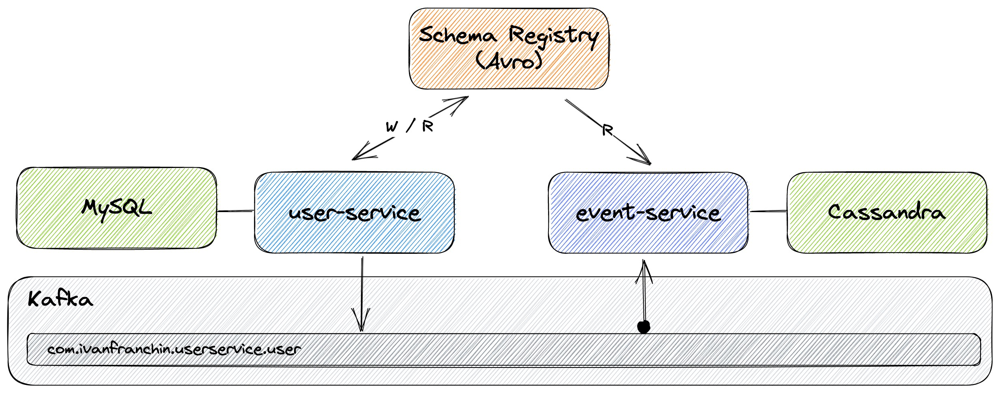
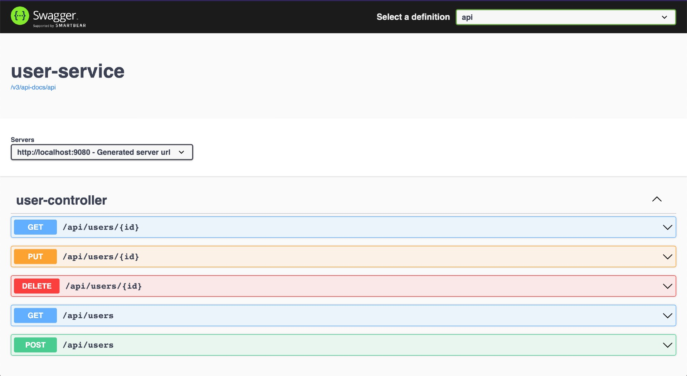
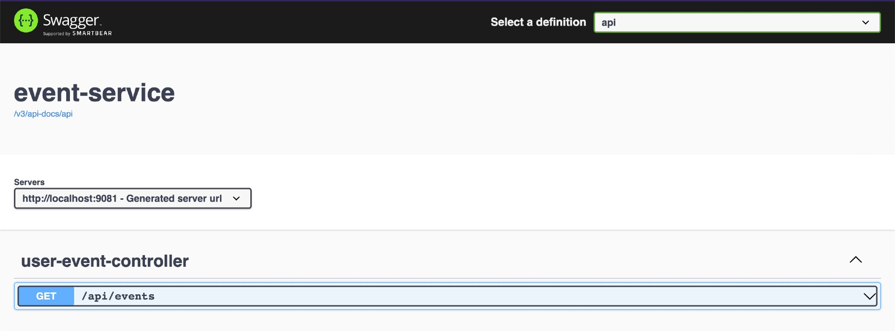
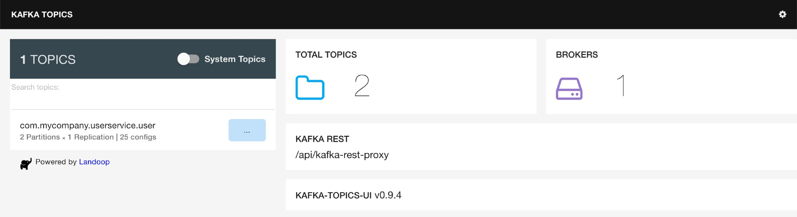
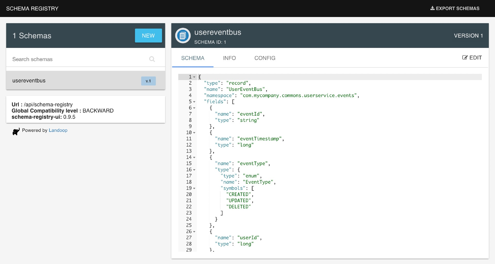
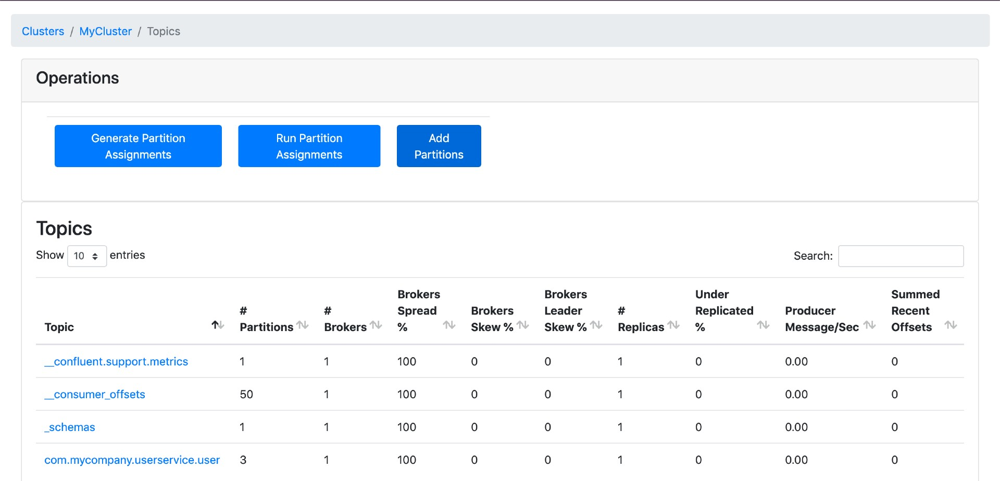

# spring-cloud-stream-event-sourcing-testcontainers

The goal of this project is to create a [`Spring Boot`](https://docs.spring.io/spring-boot/docs/current/reference/htmlsingle/) application that handles `users` using [`Event Sourcing`](https://martinfowler.com/eaaDev/EventSourcing.html). So, besides the traditional create/update/delete, whenever a user is created, updated, or deleted, an event informing this change is sent to [`Kafka`](https://kafka.apache.org). Furthermore, we will implement another `Spring Boot` application that listens to those events and saves them in [`Cassandra`](https://cassandra.apache.org). Finally, we will use [`Testcontainers`](https://www.testcontainers.org) for integration testing.

> **Note**: In [`kubernetes-minikube-environment`](https://github.com/ivangfr/kubernetes-minikube-environment/tree/master/user-event-sourcing-kafka) repository, it's shown how to deploy this project in `Kubernetes` (`Minikube`)

## Project Architecture



## Applications

- ### user-service

  `Spring Boot` Web Java application responsible for handling users. The user information is stored in [`MySQL`](https://www.mysql.com). Once a user is created, updated or deleted, an event is sent to `Kafka`.
  
  

  - **Serialization format**

    `user-service` can use [`JSON`](https://www.json.org) or [`Avro`](https://avro.apache.org) format to serialize data to the `binary` format used by `Kafka`. If we choose `Avro`, both services will benefit by the [`Schema Registry`](https://docs.confluent.io/platform/current/schema-registry/index.html) that is running as Docker container. The serialization format to be used is defined by the value set to the environment variable `SPRING_PROFILES_ACTIVE`.
  
    | Configuration                    | Format |
    |----------------------------------|--------|
    | `SPRING_PROFILES_ACTIVE=default` | `JSON` |
    | `SPRING_PROFILES_ACTIVE=avro`    | `Avro` |

- ### event-service

  `Spring Boot` Web Java application responsible for listening events from `Kafka` and saving them in `Cassandra`.

  

  - **Deserialization**
  
    Differently from `user-service`, `event-service` has no specific Spring profile to select the deserialization format. [`Spring Cloud Stream`](https://docs.spring.io/spring-cloud-stream/docs/current/reference/html/spring-cloud-stream.html) provides a stack of `MessageConverters` that handle the conversion of many types of content-types, including `application/json`. Besides, as `event-service` has `SchemaRegistryClient` bean registered, `Spring Cloud Stream` auto configures an Apache Avro message converter for schema management.
    
    In order to handle different content-types, `Spring Cloud Stream` has a _"content-type negotiation and transformation"_ strategy (more [here](https://docs.spring.io/spring-cloud-stream/docs/current/reference/html/spring-cloud-stream.html#content-type-management)). The precedence orders are: first, content-type present in the message header; second, content-type defined in the binding; and finally, content-type is `application/json` (default).
    
    The producer (in the case `user-service`) always sets the content-type in the message header. The content-type can be `application/json` or `application/*+avro`, depending on with which `SPRING_PROFILES_ACTIVE` the `user-service` is started.
  
  - **Java classes from Avro Schema**
  
    Run the following command in `spring-cloud-stream-event-sourcing-testcontainers` root folder. It will re-generate the Java classes from the Avro schema present at `event-service/src/main/resources/avro`.
    ```
    ./mvnw compile --projects event-service
    ```
  
## Prerequisites

- [`Java 17+`](https://www.oracle.com/java/technologies/downloads/#java17)
- [`Docker`](https://www.docker.com/)
- [`Docker-Compose`](https://docs.docker.com/compose/install/)

## Start Environment

- In a terminal and inside `spring-cloud-stream-event-sourcing-testcontainers` root folder run
  ```
  docker-compose up -d
  ```

- Wait for Docker containers to be up and running. To check it, run
  ```
  docker-compose ps
  ```

## Running Applications with Maven

- **user-service**

  - In a terminal, make sure you are inside `spring-cloud-stream-event-sourcing-testcontainers` root folder
  
  - In order to run the application, you can pick between `JSON` or `Avro`
    - Using `JSON`
      ```
      ./mvnw clean spring-boot:run --projects user-service
      ```
    - Using `Avro`
      ```
      ./mvnw clean spring-boot:run --projects user-service -Dspring-boot.run.profiles=avro
      ```

- **event-service**

  - In a new terminal, make sure you are inside `spring-cloud-stream-event-sourcing-testcontainers` root folder
  
  - Run the following command
    ```
    ./mvnw clean spring-boot:run --projects event-service
    ```

## Running Applications as Docker containers

- ### Build Docker Images

  - In a terminal, make sure you are inside `spring-cloud-stream-event-sourcing-testcontainers` root folder

  - Run the following script to build the Docker images
    - JVM 
      ```
      ./docker-build.sh
      ```
    - Native (it's not implemented yet)
      ```
      ./docker-build.sh native
      ```

- ### Environment Variables
   
  - **user-service**

    | Environment Variable   | Description                                                                          |
    |------------------------|--------------------------------------------------------------------------------------|
    | `MYSQL_HOST`           | Specify host of the `MySQL` database to use (default `localhost`)                    |
    | `MYSQL_PORT`           | Specify port of the `MySQL` database to use (default `3306`)                         |
    | `KAFKA_HOST`           | Specify host of the `Kafka` message broker to use (default `localhost`)              |
    | `KAFKA_PORT`           | Specify port of the `Kafka` message broker to use (default `29092`)                  |
    | `SCHEMA_REGISTRY_HOST` | Specify host of the `Schema Registry` to use (default `localhost`)                   |
    | `SCHEMA_REGISTRY_PORT` | Specify port of the `Schema Registry` to use (default `8081`)                        |
    | `ZIPKIN_HOST`          | Specify host of the `Zipkin` distributed tracing system to use (default `localhost`) |
    | `ZIPKIN_PORT`          | Specify port of the `Zipkin` distributed tracing system to use (default `9411`)      |

  - **event-service**

    | Environment Variable   | Description                                                                          |
    |------------------------|--------------------------------------------------------------------------------------|
    | `CASSANDRA_HOST`       | Specify host of the `Cassandra` database to use (default `localhost`)                |
    | `CASSANDRA_PORT`       | Specify port of the `Cassandra` database to use (default `9042`)                     |
    | `KAFKA_HOST`           | Specify host of the `Kafka` message broker to use (default `localhost`)              |
    | `KAFKA_PORT`           | Specify port of the `Kafka` message broker to use (default `29092`)                  |
    | `SCHEMA_REGISTRY_HOST` | Specify host of the `Schema Registry` to use (default `localhost`)                   |
    | `SCHEMA_REGISTRY_PORT` | Specify port of the `Schema Registry` to use (default `8081`)                        |
    | `ZIPKIN_HOST`          | Specify host of the `Zipkin` distributed tracing system to use (default `localhost`) |
    | `ZIPKIN_PORT`          | Specify port of the `Zipkin` distributed tracing system to use (default `9411`)      |

- ### Run Docker Containers

  - In a terminal, make sure you are inside `spring-cloud-stream-event-sourcing-testcontainers` root folder

  - In order to run the application's Docker container, you can pick between `JSON` or `Avro`
    - Using `JSON`
      ```
      ./start-apps.sh
      ```
    - Using `Avro`
      ```
      ./start-apps.sh avro
      ```

## Applications URLs

| Application   | URL                                   |
|---------------|---------------------------------------|
| user-service  | http://localhost:9080/swagger-ui.html |
| event-service | http://localhost:9081/swagger-ui.html |

## Playing around

1. Create a user
   ```
   curl -i -X POST localhost:9080/api/users \
     -H  "Content-Type: application/json" \
     -d '{"email":"ivan.franchin@test.com","fullName":"Ivan Franchin","active":true}'
   ```

2. Check whether the event related to the user creation was received by `event-service`
   ```
   curl -i "localhost:9081/api/events?userId=1"
   ```

3. You can check the traces in [`Zipkin`](https://zipkin.io) http://localhost:9411.

4. Access `user-service` and create new users and/or update/delete existing ones. Then, access `event-service` Swagger website to validate if the events were sent correctly

## Useful Commands & Links

- **MySQL**
  ```
  docker exec -it -e MYSQL_PWD=secret mysql mysql -uroot --database userdb
  SELECT * FROM users;
  ```
  > Type `exit` to leave `MySQL Monitor`

- **Cassandra**
  ```
  docker exec -it cassandra cqlsh
  USE ivanfranchin;
  SELECT * FROM user_events;
  ```
  > Type `exit` to leave `CQL shell`

- **Zipkin**

  `Zipkin` can be accessed at http://localhost:9411

- **Kafka Topics UI**

  `Kafka Topics UI` can be accessed at http://localhost:8085

  

- **Schema Registry UI**

  `Schema Registry UI` can be accessed at http://localhost:8001

  

- **Kafka Manager**

  `Kafka Manager` can be accessed at http://localhost:9000

  _Configuration_

  - First, you must create a new cluster. Click on `Cluster` (dropdown button on the header) and then on `Add Cluster`
  - Type the name of your cluster in `Cluster Name` field, for example: `MyCluster`
  - Type `zookeeper:2181` in `Cluster Zookeeper Hosts` field
  - Enable checkbox `Poll consumer information (Not recommended for large # of consumers if ZK is used for offsets tracking on older Kafka versions)`
  - Click on `Save` button at the bottom of the page.

  The image below shows the topics present in Kafka, including the topic `com.ivanfranchin.userservice.user` with `3`
partitions.

  

## Shutdown

- Stop applications
  - If they were started with `Maven`, go to the terminals where they are running and press `Ctrl+C`
  - If they were started as a Docker container, run the script below
    ```
    ./stop-apps.sh
    ```

- To stop and remove docker-compose containers, networks and volumes, make sure you are inside `spring-cloud-stream-event-sourcing-testcontainers` root folder and run
  ```
  docker-compose down -v
  ```

## Running tests

- **event-service**

  - Run the command below to start the **Unit Tests**
    > **Note**: `Testcontainers` will start automatically `Cassandra` Docker container before some tests begin and will shut it down when the tests finish.
    ```
    ./mvnw clean test --projects event-service
    ```

- **user-service**

  - Run the command below to start the **Unit Tests**
    ```
    ./mvnw clean test --projects user-service
    ```

  - Run the command below to start the **Unit** and **Integration Tests**
    > **Warning**: Make sure you have an updated `event-service` Docker image.
    
    > **Note**: `Testcontainers` will start automatically `Zookeeper`, `Kafka`, `MySQL`, `Cassandra` and `event-service` Docker containers before the tests begin and will shut them down when the tests finish.
 
    - Using `JSON`
      ```
      ./mvnw clean verify --projects user-service -DargLine="-Dspring.profiles.active=test"
      ```
    - Using `Avro`
      ```
      ./mvnw clean verify --projects user-service -DargLine="-Dspring.profiles.active=test,avro"
      ```

## Cleanup

To remove the Docker images created by this project, go to a terminal and, inside `spring-cloud-stream-event-sourcing-testcontainers` root folder, run the following script
```
./remove-docker-images.sh
```

## Issues

- Disabled `UserEventRepositoryTest` as it's getting stuck at line shown below
  ```
  ...
  [main] DEBUG org.apache.cassandra.db.commitlog.AbstractCommitLogService - Will update the commitlog markers every 100ms and flush every 10000ms
  ```

- The integration tests `testCreateUser`, `testUpdateUser` and `testDeleteUser` in `user-service` are failing because the application is not connecting to Kafka container, so the events are not sent.

- Differently from before, the traceId does not propagate from `user-service` to `event-service`. Furthermore, the traceId/spanId is just present in log of the first message that `event-service` consumes. Sample below

  **user-service logs**
  ```
  2023-01-09T18:58:39.029Z  INFO [user-service,63bc63de96c50a98efc7d77186e6f6aa,efc7d77186e6f6aa] 1 --- [nio-9080-exec-8] c.i.userservice.kafka.UserStream         :
  ---
  Headers: {partitionKey=9, id=bfd112d2-87e2-8004-5382-4c5896cd54a6, timestamp=1673290718971}
  
  Payload: UserEventMessage(eventId=7f4d2b1a-341e-499b-a8c0-ac7bb7e6de11, eventTimestamp=1673290718965, eventType=CREATED, userId=9, userJson={"email":"ivan9.franchin@test.com","fullName":"Ivan Franchin","active":true})
  ---
  2023-01-09T18:58:54.381Z  INFO [user-service,63bc63eee1e7f04a9497dd8278089048,9497dd8278089048] 1 --- [nio-9080-exec-1] c.i.userservice.kafka.UserStream         :
  ---
  Headers: {partitionKey=10, id=e202d905-7efa-18bc-d624-af480e77b6d3, timestamp=1673290734377}
  
  Payload: UserEventMessage(eventId=b42f7a2c-5bdc-4e83-b40f-8990f30c52cd, eventTimestamp=1673290734377, eventType=CREATED, userId=10, userJson={"email":"ivan10.franchin@test.com","fullName":"Ivan Franchin","active":true})
  ---
  ```
  
  **event-service logs**
  ```
  2023-01-09T18:58:39.247Z  INFO [event-service,63bc63df64b701de43c6b88640895ac1,43c6b88640895ac1] 1 --- [container-0-C-1] c.i.eventservice.kafka.UserStream        :
  ---
  Headers: {deliveryAttempt=1, kafka_timestampType=CREATE_TIME, scst_partition=0, kafka_receivedTopic=com.ivanfranchin.userservice.user, kafka_offset=7, partitionKey=9, scst_nativeHeadersPresent=true, kafka_consumer=org.apache.kafka.clients.consumer.KafkaConsumer@3f161e43, source-type=kafka, id=393e13b3-35f5-2d9f-d2f6-4263f7bd994c, kafka_receivedPartitionId=0, contentType=application/json, kafka_receivedTimestamp=1673290719008, kafka_groupId=eventServiceGroup, timestamp=1673290719243}
  
  Payload: {"eventId": "7f4d2b1a-341e-499b-a8c0-ac7bb7e6de11", "eventTimestamp": 1673290718965, "eventType": "CREATED", "userId": 9, "userJson": "{\"email\":\"ivan9.franchin@test.com\",\"fullName\":\"Ivan Franchin\",\"active\":true}"}
  ---
  2023-01-09T18:58:54.397Z  INFO [event-service,,] 1 --- [container-0-C-1] c.i.eventservice.kafka.UserStream        :
  ---
  Headers: {deliveryAttempt=1, kafka_timestampType=CREATE_TIME, scst_partition=0, kafka_receivedTopic=com.ivanfranchin.userservice.user, kafka_offset=8, partitionKey=10, scst_nativeHeadersPresent=true, kafka_consumer=org.apache.kafka.clients.consumer.KafkaConsumer@3f161e43, source-type=kafka, id=aa18c615-ac2a-b8cf-ff26-c34e5687da6b, kafka_receivedPartitionId=0, contentType=application/json, kafka_receivedTimestamp=1673290734380, kafka_groupId=eventServiceGroup, timestamp=1673290734397}
  
  Payload: {"eventId": "b42f7a2c-5bdc-4e83-b40f-8990f30c52cd", "eventTimestamp": 1673290734377, "eventType": "CREATED", "userId": 10, "userJson": "{\"email\":\"ivan10.franchin@test.com\",\"fullName\":\"Ivan Franchin\",\"active\":true}"}
  ---
  ```