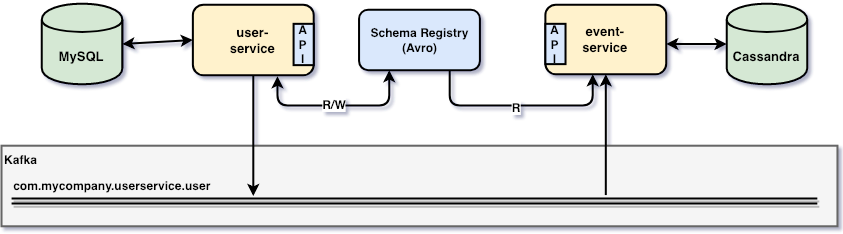
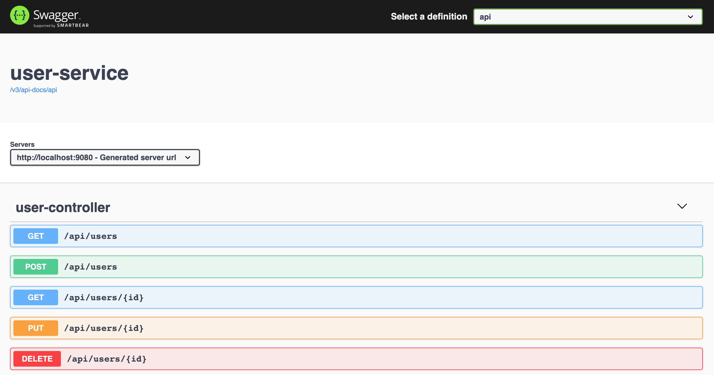
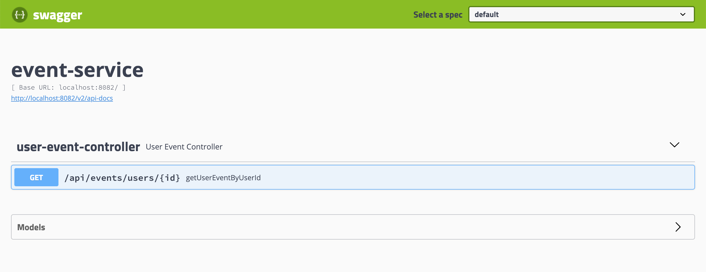
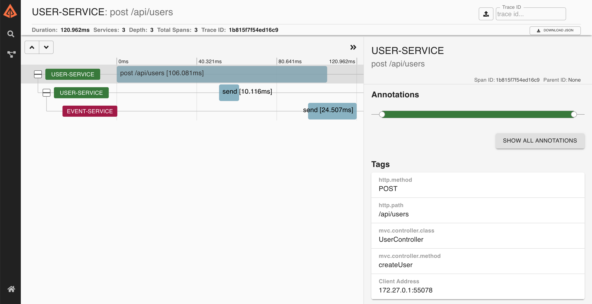
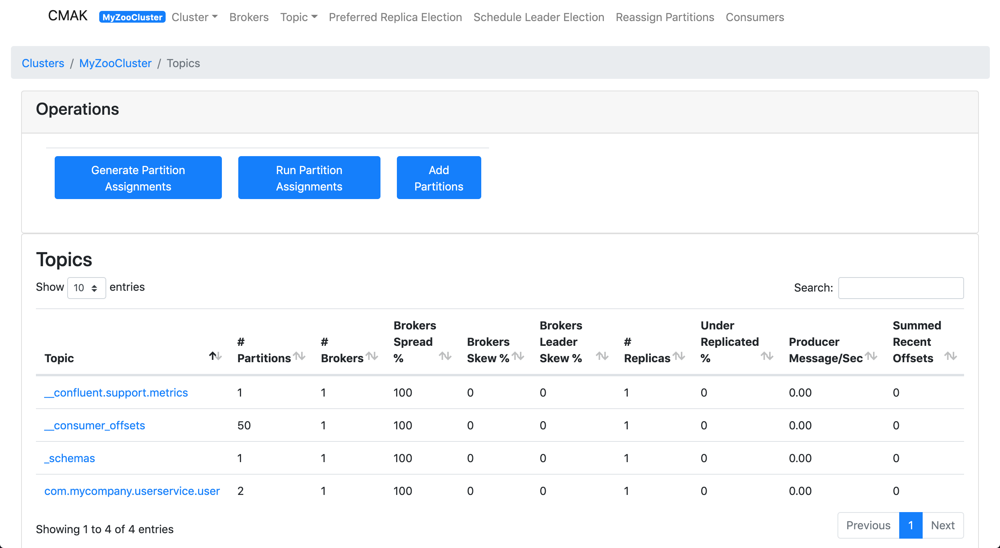

# `springboot-kafka-mysql-cassandra`

The goal of this project is to create a service that handles `users` using
[`Event Sourcing`](https://martinfowler.com/eaaDev/EventSourcing.html). So, besides the traditional create/update/delete,
whenever an user is created/updated/deleted, an event informing this change is sent to [`Kafka`](https://kafka.apache.org).
Furthermore, we will implement a service that will listen to those events and save them in [`Cassandra`](http://cassandra.apache.org).

## Project Architecture



## Microservice

### user-service

Spring-boot Web Java application responsible for handling users. The users information will be stored in
[`MySQL`](https://www.mysql.com). Once an user is created/updated/deleted, one event is sent to `Kafka`.

#### Serialization format 

`user-service` can use [`JSON`](https://www.json.org) or [`Avro`](https://avro.apache.org) format to serialize
data to the `binary` format used by Kafka. If `Avro` format is chosen, both services will benefit by the
[`Schema Registry`](https://docs.confluent.io/current/schema-registry/docs/index.html) that is running as Docker
container. The serialization format used is defined by value set to the environment variable `SPRING_PROFILES_ACTIVE`,
present in the `user-service` section in `docker-compose.yml`.

| Configuration                    | Format |
| -------------------------------- | ------ |
| `SPRING_PROFILES_ACTIVE=default` | `JSON` |
| `SPRING_PROFILES_ACTIVE=avro`    | `Avro` |

### event-service

Spring-boot Web Java application responsible for listening events from `Kafka` and saving those events in `Cassandra`.

#### Deserialization

Differently from `user-service`, `event-service` has no specific spring profile to select the deserialization format.
Spring Cloud Stream provides a stack of `MessageConverters` that handle the conversion of many different types of
content-types, including `application/json`. Besides, as `event-service` has `SchemaRegistryClient` bean registered,
Spring Cloud Stream auto configures an Apache Avro message converter for schema management.

In order to handle different content-types, Spring Cloud Stream  has a "content-type negotiation and transformation"
strategy (https://docs.spring.io/spring-cloud-stream/docs/current/reference/htmlsingle/#content-type-management). The
precedence orders are: first, content-type present in the message header; second, content-type defined in the binding;
and finally, content-type is `application/json` (default).

The producer (in the case `user-service`) always sets the content-type in the message header. The content-type can be
`application/json` or `application/*+avro`, depending on with which `SPRING_PROFILES_ACTIVE` `user-service` is started.

#### Java classes from Avro Schema

Run the following command in `springboot-kafka-mysql-cassandra` root folder. It will re-generate the Java classes from
the Avro schema present at `event-service/src/main/resources/avro`.
```
./gradlew event-service:generateAvro
```

## Build Docker Images
  
In a terminal and inside `springboot-kafka-mysql-cassandra` root folder, run the following `./gradlew` commands to
build the microservices docker images

### user-service

```
./gradlew user-service:docker -x test
```
| Environment Variable   | Description                                                                          |
| ---------------------- | ------------------------------------------------------------------------------------ |
| `MYSQL_HOST`           | Specify host of the `MySQL` database to use (default `localhost`)                    |
| `MYSQL_PORT`           | Specify port of the `MySQL` database to use (default `3306`)                         |
| `KAFKA_HOST`           | Specify host of the `Kafka` message broker to use (default `localhost`)              |
| `KAFKA_PORT`           | Specify port of the `Kafka` message broker to use (default `29092`)                  |
| `SCHEMA_REGISTRY_HOST` | Specify host of the `Schema Registry` to use (default `localhost`)                   |
| `SCHEMA_REGISTRY_PORT` | Specify port of the `Schema Registry` to use (default `8081`)                        |
| `ZIPKIN_HOST`          | Specify host of the `Zipkin` distributed tracing system to use (default `localhost`) |
| `ZIPKIN_PORT`          | Specify port of the `Zipkin` distributed tracing system to use (default `9411`)      |

### event-service

```
./gradlew event-service:docker -x test
```
| Environment Variable   | Description                                                                          |
| ---------------------- | ------------------------------------------------------------------------------------ |
| `CASSANDRA_HOST`       | Specify host of the `Cassandra` database to use (default `localhost`)                |
| `CASSANDRA_PORT`       | Specify port of the `Cassandra` database to use (default `9042`)                     |
| `KAFKA_HOST`           | Specify host of the `Kafka` message broker to use (default `localhost`)              |
| `KAFKA_PORT`           | Specify port of the `Kafka` message broker to use (default `29092`)                  |
| `SCHEMA_REGISTRY_HOST` | Specify host of the `Schema Registry` to use (default `localhost`)                   |
| `SCHEMA_REGISTRY_PORT` | Specify port of the `Schema Registry` to use (default `8081`)                        |
| `ZIPKIN_HOST`          | Specify host of the `Zipkin` distributed tracing system to use (default `localhost`) |
| `ZIPKIN_PORT`          | Specify port of the `Zipkin` distributed tracing system to use (default `9411`)      |

## Start Environment

> Note. In order to run `user-service` with `Avro` format serialization, export the following environment variable.
> If `JSON` is preferred, skip this step.
> ```
> export USER_SERVICE_SPRING_PROFILES_ACTIVE=avro
> ```

In a terminal and inside `springboot-kafka-mysql-cassandra` root folder run
```
docker-compose up -d
```

Wait a little bit until all containers are `Up (healthy)`. You can check their status running
```
docker-compose ps
```

## Microservice URLs

| Microservice    | URL                                   |
| --------------- | ------------------------------------- |
| `user-service`  | http://localhost:9080/swagger-ui.html |
| `event-service` | http://localhost:9081/swagger-ui.html |

## Running Microservices with Gradle

During development, it is better to just run the microservices instead of always build the docker images and run it.
In order to do it, comment the `user-service` and/or `event-service` in `docker-compose.yml` file and run the
microservice(s) with Gradle Wrapper.

### user-service
```
./gradlew user-service:bootRun -Dserver.port=9080
```

### event-service
```
./gradlew event-service:bootRun -Dserver.port=9081
```

## Playing around with the microservices

- Open `user-service` Swagger http://localhost:9080/swagger-ui.html



- Create a new user, `POST /api/users`

- Open `event-service` Swagger http://localhost:9081/swagger-ui.html



- Get all events related to the user created, informing the user id `GET /api/events/users/{id}`

- You can also check how the event was sent by `user-service` and listened by `event-service` (as shown on the image
below) using [`Zipkin`](https://zipkin.io) http://localhost:9411



- Create new users and update/delete existing ones in order to see how the application works.

## Shutdown

To stop and remove containers, networks and volumes, run
```
docker-compose down -v
```

## Running tests

### event-service 

Run the command below to trigger `event-service` test cases
```
./gradlew event-service:test
```

### user-service

Run the following command to start `user-service` test cases
```
./gradlew user-service:test
```
> Note: We are using [`Testcontainers`](https://www.testcontainers.org/) to run `user-service` integration tests.  It
starts automatically some Docker containers before the tests begin and shuts the containers down when the tests finish.

## Useful Commands & Links

### MySQL Database
```
docker exec -it mysql mysql -uroot -psecret
use userdb;
select * from users;
```

### Cassandra Database
```
docker exec -it cassandra cqlsh
USE mycompany;
SELECT * FROM user_events;
```

### Zipkin

`Zipkin` can be accessed at http://localhost:9411

### Kafka Topics UI

`Kafka Topics UI` can be accessed at http://localhost:8085


### Schema Registry UI

`Schema Registry UI` can be accessed at http://localhost:8001


### Kafka Manager

`Kafka Manager` can be accessed at http://localhost:9000

**Configuration**
- First, you must create a new cluster. Click on `Cluster` (dropdown on the header) and then on `Add Cluster`
- Type the name of your cluster in `Cluster Name` field, for example: `MyZooCluster`
- Type `zookeeper:2181`in `Cluster Zookeeper Hosts` field
- Enable checkbox `Poll consumer information (Not recommended for large # of consumers if ZK is used for offsets tracking on older Kafka versions)`
- Click on `Save` button at the bottom of the page.

The image below shows the topics present on Kafka, including the topic `com.mycompany.userservice.user` with `2`
partitions, that is used by the microservices of this project.



## References

- https://docs.spring.io/spring-cloud-stream/docs/current/reference/htmlsingle/
- https://docs.docker.com/reference/
- https://docs.docker.com/compose/compose-file/compose-versioning/
